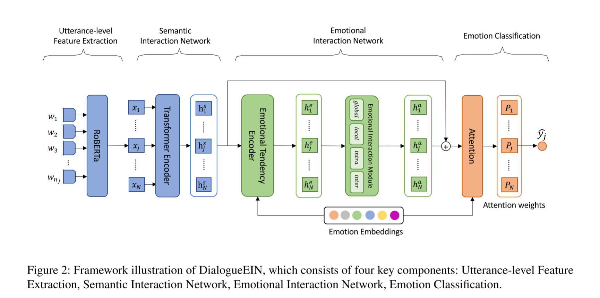

# DialogueEIN

## Introduction

This is a reproduction on [DialogueEIN](https://aclanthology.org/2022.coling-1.57/): Emotion Interaction Network for Dialogue Affective Analysis-COLING22.

Project structure refers to @shenwzh3/DAG-ERC. Features and Dataset can be found there.

## Model

## Experiment Result

|                              | IEMOCAP   | MELD      |
| ---------------------------- | --------- | --------- |
| **Ref**-weighted-avg-f-score | **68.93** | **65.37** |
| result-v1                    | 64.22     | 62.65     |
| result-SSC                   | 65.67     | 63.59     |
| result-v2                    | 62.83     | 63.3      |
| result-v3                    | 63.38     | 63.03     |
| result-v4                    | 63.84     | 63.1      |
| result-v5                    | 64.6      | 64.52     |
| result-v6                    | 63.56     | **65.11** |

## explanation

- V1: the inputs of the encoder in the semantic interaction network are featrues have been extracted by roberta-large in advance, fixed.
- SSC: remove DialogueEIN structure, substitute with a three layers MLP, hidden size the same with BERT config.hidden_size.
- V2: nearly the same as DialogueEIN raised in original paper, except separate learning rate and the linear transform layer after roberta.

- V3: add linear transform compared to v2
- V4: add separate learning rate compared to v3
- V5: add linear learning rate decay compared to v4
- V6: fix a fatal bug: extended_mask should be -10000 or 0

## Some Validation Experiments

|                           | Acc       | F1-score-avg |
| ------------------------- | --------- | ------------ |
| DAG-v2                    | 91.13     | 91.66        |
| DialogueEIN-roberta-large | 91.68     | 89.47        |
| DialogueEIN-feature-fixed | **95.52** | **95.71**    |

These experiments trained on **JDDC** dataset. Params setting is nearly the same as original paper(bsz=8, lr settings are exactly two groups refered in paper, local_att_window_size=7)

Expr1 and Expr3 are feature fixed(using features extracted from chinese-roberta-base-wwm) and all use last four layers cls as utterance feature.

feature-fixed method boost the model performance showing my reproduction is relatively believable.

## Some Ablation Experiments

|          Model\Metric           |  Acc  | f-score-weighted |
| :-----------------------------: | :---: | :--------------: |
|           w/o  local            | 91.41 |       92.3       |
|            w/o intra            | 96.44 |      96.48       |
|           w/o  inter            | 95.8  |      95.65       |
|           w/o global            | 94.24 |      94.08       |
|        w/o  emotion-ebd         | 88.21 |      89.41       |
|     w/o emotion-interaction     | 89.03 |      89.67       |
| DialogueEIN-feature-fixed-share | 93.42 |      93.96       |
|     separate-emo-embedding      | 95.34 |      95.56       |
|          w/o residual           | 93.05 |       93.5       |
|        encoder_layer = 2        | 94.06 |      94.43       |

Some model structure modification and ablation, which are implemented on **JDDC** Chinese Dataset.

## Some annoying bugs

on the reproduction on MELD, I wrongly choose the 12th layer cls repr as the utterance feature using roberta-large, so the result-v4 on MELD is little worse than original paper.

the training process on IEMOCAP isn't that satisfactory...
